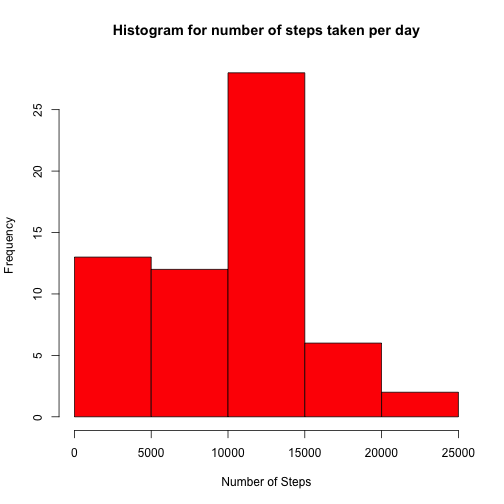

Load dplyr package and Read the file activity.csv.

```r
library(dplyr)
data <- read.csv("activity.csv", header=TRUE, stringsAsFactors=FALSE)
```

Prepare the data by using dplyr package. 
Do a group by on date.


```r
data$date <- as.Date(data$date)
grouped_date <- group_by(data, date)
```

## Calculate Total number of steps taken per day
Use summarize function in dplyr to add the steps for all the interval on a day.

```r
steps_per_day <- summarize(grouped_date, sum(steps, na.rm=TRUE))
names(steps_per_day) <- c("Date","TotalSteps")
```

Draw the histogram using base plot system.

```r
hist(steps_per_day$TotalSteps, xlab="Number of Steps", main="Histogram for number of steps taken per day", col="red")
```

 


Mean of total number of steps taken per day:

```r
mean(steps_per_day$TotalSteps)
```

```
## [1] 9354.23
```
Median of total number of steps taken per day:

```r
median(steps_per_day$TotalSteps)
```

```
## [1] 10395
```

## Average daily activity pattern

Calculating steps per interval across all days using dplyr package.


```r
grouped_interval <- group_by(data,interval)
steps_per_interval <- summarize(grouped_interval,mean(steps, na.rm=TRUE))
names(steps_per_interval) <- c("Interval", "Steps")
```


Time series plot of the 5-minute interval (x-axis) and the average number of steps taken, averaged across all days (y-axis)


```r
plot(steps_per_interval$Interval,steps_per_interval$Steps, type="l", col="red" , xlab="Interval" , ylab="Mean of Steps per Interval across all days", xaxt="n")
axis(side=1,at=seq(from=0, to=2400, by=50))
```

 


The 5-minute interval, on average across all the days that contains the maximum number of steps is


```r
steps_per_interval$Interval[which.max(steps_per_interval$Steps)]
```

```
## [1] 835
```


## Imputing missing values


Total number of missing values in the dataset

```r
sum(is.na(data$steps))
```

```
## [1] 2304
```

Use mean for the 5-minute interval to fill in NA values. The new dataset is data_witout_NA


```r
data_witout_NA <- data
for(x in 1:length(data_witout_NA$steps)) {
   if(is.na(data_witout_NA$steps[x])) {
    interval <- data_witout_NA$interval[x]
    index <- which(steps_per_interval$Interval== interval, TRUE)
    data_witout_NA$steps[x] <- round(steps_per_interval$Steps[index])
  }
}
```
Histogram of the total number of steps after filling in missing values.

```r
grouped_date_withoutNA <- group_by(data_witout_NA, date)
steps_per_day_withoutNA <- summarize(grouped_date_withoutNA, sum(steps))
names(steps_per_day_withoutNA) <- c("Date","TotalSteps")
hist(steps_per_day_withoutNA$TotalSteps, xlab="Number of Steps", main="Histogram for number of steps (No NAs) taken per day", col="blue")
```

 

Mean of total number of steps taken per day. 

```r
mean(steps_per_day_withoutNA$TotalSteps)
```

```
## [1] 10765.64
```

Median of total number of steps taken per day

```r
median(steps_per_day_withoutNA$TotalSteps)
```

```
## [1] 10762
```
* By replacing NAs with mean of the interval across all the days, the mean and median increased slightly. Also total number of steps taken each day has obviously increased as we added extra numbers ( earlier NAs) for each day. This is depicted in the histogram.  


## Activity patterns between weekdays and weekends


Add the dayType variable to dataset. The value can be Weekend or Weekday.

```r
for(x in 1:length(data_witout_NA$steps)) {
    dayType <- weekdays(data_witout_NA$date[x])
    if(dayType == "Saturday" || dayType == "Sunday") {
      data_witout_NA$dayType[x] <- "Weekend"
    } else {
      data_witout_NA$dayType[x] <- "Weekday"
    }
  
}
```

Do a group by on dayType and Interval. 

```r
grouped_week <- group_by(data_witout_NA, dayType, interval)
week_data <- summarize(grouped_week,round(mean(steps)))
names(week_data) <- c("dayType","interval", "steps")
```

Panel containing a time series plot  of the 5-minute interval (x-axis) and the average number of steps taken, averaged across all weekday days or weekend days (y-axis) using lattice plot system.


```r
library(lattice)
xyplot(steps ~ interval | dayType, data = week_data, layout = c(1, 2), ylab = "Number of steps", 
    main = "Average number of steps for all weekdays and weekends" ,xlab = "Interval", type="l" )
```

 

